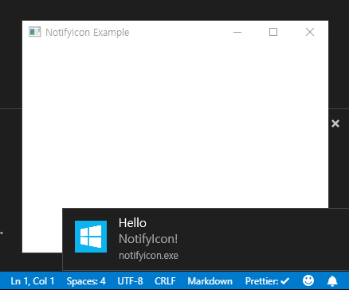

## NotifyIcon Example

This is an example application that uses Notify Icon.

Here's a screenshot:



### Build

You may use [rsrc] tool to embed icon as a resource in the executable:

```
$ go get github.com/akavel/rsrc
$ rsrc -ico icon.ico -o rsrc.syso
$ go build
```

In this way, you can distribute the executable without an icon file(recommended).

Alternatively you can just build it, and place an icon file with the executable in same directory:

```
$ go build
```

[rsrc]: https://github.com/akavel/rsrc
